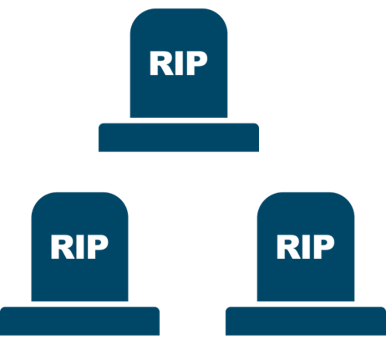
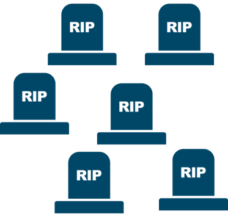
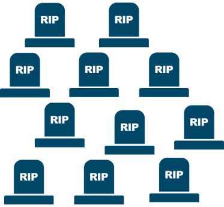
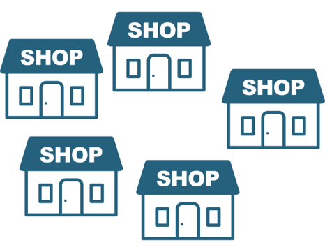
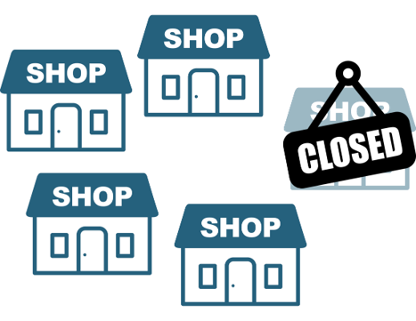
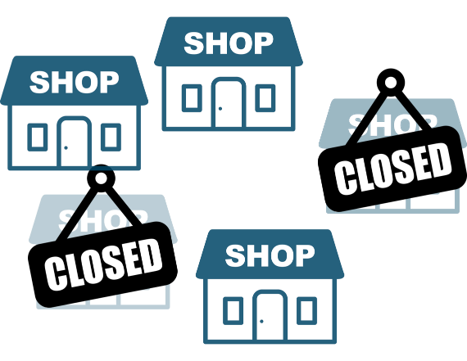

# Icons used for the attributes/levels

## Attributes

### Public health measures

| Basic measures | Social distancing | Lockdown |
|:----------------------:|:----------------------:|:----------------------:|
|  |  |  |

### Duration of public health measures

| 3 months | 6 months | 9 months |
|:----------------------:|:----------------------:|:----------------------:|
|  |  |  |

### Vaccination available at the end of the public health measures

|          Probably available          |            Not available             |
|:----------------------------------:|:----------------------------------:|
|  |  |

### Infection risk per family

| 25% | 50% | 90% |
|:----------------------:|:----------------------:|:----------------------:|
|  |  |  |

### Overal mortality

| Low | Mid | High |
|:----------------------:|:----------------------:|:----------------------:|
|  |  |  |

### Education

| 5 in 25 fall behind | 10 in 25 fall behind |
|:----------------------------------:|:----------------------------------:|
|  |  |

### Finances

| No impact | 1 in 5 close | 2 in 5 close |
|:----------------------:|:----------------------:|:----------------------:|
|  |  |  |

## Source

The icons were created with or modified from icons sourced from [UXWing](https://uxwing.com/)
